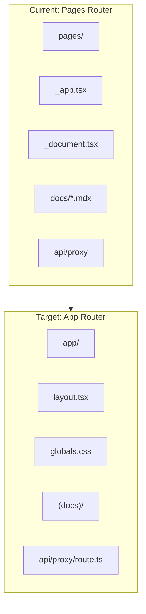

# Next.js 16 Full Migration Plan

## Current State

| Package | Current | Target |

| ------------ | ------- | ------ |

| next | 12.3.4 | 16.x |

| react | 17.0.2 | 19.x |

| react-dom | 17.0.2 | 19.x |

| @types/react | 17.x | 19.x |

| @next/mdx | 12.3.4 | 16.x |

## Architecture Changes



## Phase 1: Dependency Upgrades

Update [package.json](package.json):

**Remove deprecated packages:**

- `@zeit/next-source-maps` (abandoned, source maps now built-in)
- `@zeit/next-mdx` (replaced by @next/mdx)
- `enzyme`, `@wojtekmaj/enzyme-adapter-react-17`, `enzyme-to-json` (no React 19 support)
- `react-test-renderer` (deprecated in React 19)

**Update core dependencies:**

```json
{
  "next": "^16.0.0",
  "react": "^19.0.0",
  "react-dom": "^19.0.0",
  "@next/mdx": "^16.0.0",
  "@mdx-js/react": "^3.0.0",
  "@mdx-js/loader": "^3.0.0"
}
```

**Add new dev dependencies:**

```json
{
  "@types/react": "^19.0.0",
  "@types/react-dom": "^19.0.0",
  "@testing-library/react": "^16.0.0",
  "@testing-library/jest-dom": "^6.0.0"
}
```

---

## Phase 2: Next.js Configuration

Update [next.config.mjs](next.config.mjs):

- Remove `@zeit/next-source-maps` wrapper (source maps now built-in)
- Update MDX configuration for App Router
- Add React Compiler support (optional, stable in Next.js 16)
- Configure styled-components for App Router SSR
```javascript
import createMDX from '@next/mdx';
import remarkGfm from 'remark-gfm';

const withMDX = createMDX({
  extension: /\.mdx?$/,
  options: {
    remarkPlugins: [remarkGfm],
  },
});

export default withMDX({
  pageExtensions: ['js', 'jsx', 'md', 'mdx', 'ts', 'tsx'],
  compiler: {
    styledComponents: true,
  },
});
```


---

## Phase 3: App Router Migration

### 3.1 Create App Directory Structure

```
app/
├── layout.tsx              # Root layout (replaces _app.tsx + _document.tsx)
├── page.tsx                # Homepage (from pages/index.tsx)
├── globals.css             # Global styles
├── (docs)/
│   ├── layout.tsx          # Docs layout wrapper
│   ├── docs/
│   │   ├── page.tsx        # /docs index
│   │   ├── basics/
│   │   │   └── page.mdx
│   │   ├── advanced/
│   │   │   └── page.mdx
│   │   ├── api/
│   │   │   └── page.mdx
│   │   ├── faqs/
│   │   │   └── page.mdx
│   │   └── tooling/
│   │       └── page.mdx
│   ├── releases/
│   │   └── page.tsx
│   ├── ecosystem/
│   │   └── page.tsx
│   └── showcase/
│       └── page.tsx
└── api/
    └── proxy/
        └── [asset]/
            └── route.ts    # Route handler (replaces API route)
```

### 3.2 Root Layout

Create `app/layout.tsx` combining `_app.tsx` and `_document.tsx`:

- Move global styles to CSS file or keep in layout
- Configure styled-components SSR using `StyledComponentsRegistry`
- Set up MDXProvider

### 3.3 styled-components SSR Registry

Create `lib/registry.tsx` for styled-components App Router SSR:

```tsx
'use client';

import { useServerInsertedHTML } from 'next/navigation';
import { useState } from 'react';
import { ServerStyleSheet, StyleSheetManager } from 'styled-components';

export default function StyledComponentsRegistry({ children }) {
  const [sheet] = useState(() => new ServerStyleSheet());

  useServerInsertedHTML(() => {
    const styles = sheet.getStyleElement();
    sheet.instance.clearTag();
    return <>{styles}</>;
  });

  if (typeof window !== 'undefined') return <>{children}</>;

  return <StyleSheetManager sheet={sheet.instance}>{children}</StyleSheetManager>;
}
```

### 3.4 API Route Migration

Convert [pages/api/proxy/[asset].ts](pages/api/proxy/[asset].ts) to Route Handler:

```typescript
// app/api/proxy/[asset]/route.ts
import { NextRequest, NextResponse } from 'next/server';

export async function GET(request: NextRequest, { params }: { params: Promise<{ asset: string }> }) {
  const { asset } = await params;
  // ... handler logic
}
```

### 3.5 Data Fetching Migration

| Pages Router | App Router |

| -------------------- | ----------------------------- |

| `getInitialProps` | Server Components + `fetch()` |

| `getStaticProps` | Server Components (default) |

| `getServerSideProps` | `cache: 'no-store'` fetch |

Migrate [pages/releases.tsx](pages/releases.tsx) and [pages/ecosystem.tsx](pages/ecosystem.tsx):

- Convert to async Server Components
- Move data fetching into component body
- Use `unstable_cache` or `fetch` with caching options

---

## Phase 4: Component Updates

### 4.1 Client Components

Mark interactive components with `'use client'` directive:

- [components/Nav/index.tsx](components/Nav/index.tsx)
- [components/DocsLayout.tsx](components/DocsLayout.tsx)
- [components/LiveEdit.tsx](components/LiveEdit.tsx)
- [components/CaptureScroll.tsx](components/CaptureScroll.tsx)
- [components/Nav/SearchWithAlgolia.tsx](components/Nav/SearchWithAlgolia.tsx)

### 4.2 Link Component

Next.js 13+ `Link` no longer requires `<a>` child. Update [components/Link.tsx](components/Link.tsx) if wrapping Next Link.

### 4.3 useRouter Migration

Replace `next/router` with `next/navigation`:

- `useRouter()` → `useRouter()` from `next/navigation`
- `router.asPath` → `usePathname()` + `useSearchParams()`

---

## Phase 5: Testing Migration

### 5.1 Update Test Setup

Replace [test/setup.ts](test/setup.ts):

```typescript
import '@testing-library/jest-dom';
```

### 5.2 Migrate Tests

Convert 21 test files from Enzyme/react-test-renderer to React Testing Library:

Pattern for snapshot tests:

```typescript
// Before (react-test-renderer)
import renderer from 'react-test-renderer';
const tree = renderer.create(<Component />).toJSON();
expect(tree).toMatchSnapshot();

// After (React Testing Library)
import { render } from '@testing-library/react';
const { container } = render(<Component />);
expect(container).toMatchSnapshot();
```

### 5.3 Update Jest Config

Update `.jest.config.js`:

- Add `testEnvironment: 'jsdom'`
- Configure `moduleNameMapper` for next/navigation mocks
- Update snapshot serializers

---

## Phase 6: Cleanup

1. Delete `pages/` directory after migration verified
2. Remove deprecated dependencies from package.json
3. Update [AGENTS.md](AGENTS.md) with App Router patterns
4. Run full test suite and fix failures
5. Test production build

---

## Do's and Don'ts

| Do | Don't |

| ----------------------------------------------------------------------- | --------------------------------------------------------- |

| Run `npx @next/codemod@canary upgrade latest` first for automated fixes | Manually upgrade all packages at once without testing |

| Migrate one route at a time, verify functionality | Delete pages/ before app/ routes are working |

| Keep Pages and App Router running in parallel during migration | Mix `next/router` and `next/navigation` in same component |

| Mark components with state/effects as `'use client'` | Add `'use client'` to every component |

| Use Server Components for data fetching | Use `getInitialProps` in App Router |

| Test styled-components SSR works in production build | Assume dev mode behavior matches production |

---

## Verification Checklist

- [ ] `yarn dev` starts without errors
- [ ] Homepage renders correctly
- [ ] All /docs/\* pages render with MDX content
- [ ] Navigation and sidebar work
- [ ] Search (Algolia) works
- [ ] /releases page loads data from GitHub API
- [ ] /ecosystem page loads data from GitHub API
- [ ] /showcase page renders
- [ ] styled-components styles render on first paint (SSR)
- [ ] `yarn build` completes successfully
- [ ] `yarn test` passes
- [ ] Production deployment works